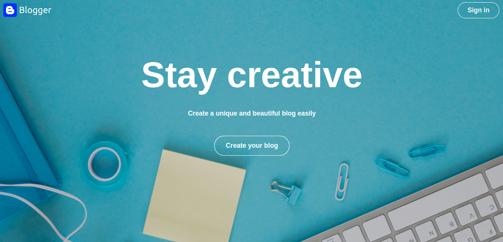

# My_portfolio_project

## Introduction:

* Deployed site: [aycrown.tech](https://www.aycrown.tech/)
* Project blog article: [How I Made My First Blogging Website](https://medium.com/@aymaneakherraz/how-did-i-make-my-first-blogging-website-4599c7361c37)
* My LinkedIn profile: [Aymane Akherraz](https://www.linkedin.com/in/aymane-akherraz-299143265/)

## Installation:

To install the dependencies in both frontend and backend dirs you should just run the following cmd in each one of them:

### `npm install`

## Usage:

You should first create the Database, you can do that by running :
### `cat create_db.sql | sudo mysql -u -p`

If you're on Windows just copy/paste the script in mysql workbench and run it.

Then you need to change the origin with yours here in Backend/app.js:
```
app.use(cors({
  origin: 'https://www.aycrown.tech',
  credentials: true
}));
```
or if you're working locally you can just set: http://localhost:3000/ (adjust the port if necessary).

Also in Frontend/src/axiosConfig.js you should change the baseURL:
``` 
axios.defaults.baseURL = '/api';
```
Again if you're working locally you can just set: http://localhost:5000/ (adjust the port if necessary).

To start the React app locally:

### `npm start`

Runs the app in the development mode.
Open [http://localhost:3000](http://localhost:3000) to view it in your browser.

If you want to deploy it:

### `npm run build`

Builds the app for production to the build folder.
It correctly bundles React in production mode and optimizes the build for the best performance.

My landing page:


